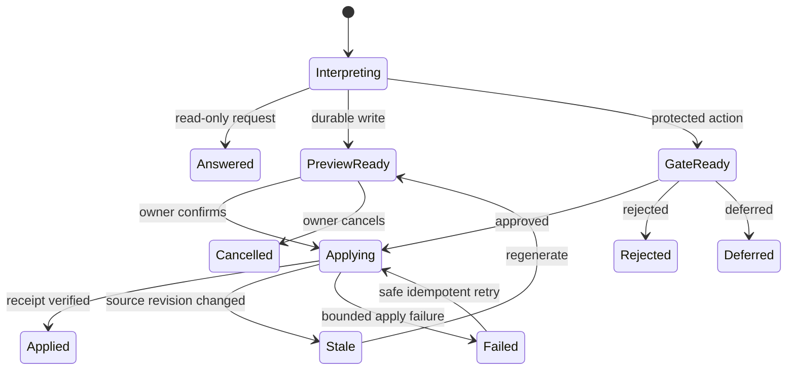

# LoopX Personal Agent Workspace — Final Design

## Status

- Product surface: personal Goal and Agent workspace
- Primary interaction: channel-style Chat
- Default Agent: Codex when healthy and compatible
- Audience: one owner managing personal Goals, Todos, Agent work, and recurring execution
- Implementation target: `apps/presentation/dashboard`
- Design reference: [final desktop mockup](public/showcase/loopx-personal-agent-control-plane-final.png)
- Review state: owner approved the first-screen direction on 2026-08-12


## Product Decision

LoopX uses one personal workspace with three layers:

1. A single left sidebar for the Manager and Goal directory.
2. A central channel timeline for conversation, progress, decisions, and outputs.
3. A contextual right drawer for focused inspection and action.

The main surface is optimized for reading and conversation. Rows do not repeat
`View`, `Correct`, `Open`, `Approve`, or `Pause` buttons. A row is the entry;
selecting it opens the right drawer, where the relevant controls and focused
Chat are available.

Natural-language requests are a first-class control path. The owner can ask
LoopX to create a Goal, assign an Agent, add Todos, configure a Goal heartbeat,
or create a recurring monitor. A durable or high-impact request produces a
structured preview before LoopX writes state or starts work.

## User Outcomes

The product must answer five questions with little interpretation:

1. What needs me now?
2. What are my Agents doing?
3. What changed or finished recently?
4. How do I correct the active work without losing context?
5. How do I describe a Goal or recurring job and let LoopX configure it safely?

## Design Principles

1. **Chat is the workspace.** Conversation and durable LoopX projections share
   one chronological surface.
2. **Browse first, act after selection.** Lists stay quiet; controls appear in
   the contextual drawer.
3. **One visible primary action.** A preview or gate exposes one emphasized
   transition. Secondary paths live in a compact overflow menu.
4. **Natural language becomes a semantic proposal.** The selected Agent
   interprets free text and may return one narrow proposal. LoopX validates
   that untrusted proposal, shows the target and impact through a typed
   preview, and keeps confirmation plus execution authority deterministic.
5. **Correction preserves continuity.** A message sent from a running detail
   drawer continues the selected Goal × Agent Session whenever it is
   recoverable.
6. **Agent identity and authority stay visible.** Every execution, proposal,
   and output names its Agent and relevant permission boundary.
7. **Technical state is available on demand.** Raw ids, quota receipts,
   registry findings, and transport diagnostics stay collapsed.
8. **Every visible claim has lineage.** Progress and completion derive from
   Todo, run, gate, artifact, or public-safe event projections.

## Information Architecture

```text
LoopX Personal Workspace
├── LoopX Manager
│   ├── needs-you digest
│   ├── active Agent work
│   ├── recent outputs
│   ├── cross-Goal conversation
│   └── natural-language action proposals
├── Goals
│   └── Goal Channel
│       ├── Chat
│       ├── Tasks
│       └── Files
├── Context Drawer
│   ├── user decision
│   ├── Todo detail
│   ├── Run / Session detail and correction
│   ├── heartbeat or monitor detail
│   └── artifact preview
└── Global tools
    ├── notifications and Lark App management
    ├── theme switch
    └── owner workspace entry
```

## Desktop Shell

```text
┌────────────────────┬──────────────────────────────────┬──────────────────────┐
│ LoopX              │ LoopX Manager          Codex ▾   │ Context drawer       │
│                    │                                  │                      │
│ Manager          3 │ Channel timeline                 │ Selected object      │
│                    │                                  │ context              │
│ Goals              │ Messages                         │                      │
│ ● Goal A          2 │ Progress / decision cards       │ Focused Chat or      │
│ ● Goal B          1 │ Action previews                 │ one primary action   │
│ ○ Goal C            │ Outputs                          │                      │
│                    │                                  │ Advanced diagnostics │
│ Notify / owner     │ [Agent ▾] Composer               │ collapsed            │
└────────────────────┴──────────────────────────────────┴──────────────────────┘
```

### Single sidebar

The narrow icon rail is removed. The sidebar contains:

- `LoopX Manager`, including the current attention count;
- the active Goal directory;
- one semantic state and optional count per Goal;
- notification management and owner identity at the bottom.

The Goal row state vocabulary is intentionally small:

- `Needs repair`
- `Needs you`
- `Waiting`
- `In progress`
- `Complete`
- `Quiet`

Completed Goals can move behind a filter. Raw Goal ids never lead the visible
row.

### Central channel

The central surface remains conversational in both contexts:

- Manager Channel: cross-Goal digest, questions, and action proposals.
- Goal Channel: Goal-scoped conversation, Todo progress, executions, gates,
  and outputs.

When a Goal is selected, compact `Chat`, `Tasks`, and `Files` tabs may appear
under the header. They are navigation, so they use text-tab treatment and do
not compete with actions.

### Context drawer

The drawer opens only after the owner selects a row or timeline object. Closing
it expands the central channel. It supports five content modes through one
stable container:

1. Decision detail
2. Todo detail
3. Run / Session detail
4. Heartbeat or recurring-monitor detail
5. Artifact preview

The drawer header states the selected object and its source Goal. `Advanced
diagnostics` remains collapsed at the bottom.

## Manager Channel

The Manager is the default route when no Goal is selected. Its initial digest
prioritizes:

1. `Needs you`
2. `Agents working`
3. `Recent outputs`

Each item is a full-row entry with a status, short reason, and chevron. Lists
contain no repeated action buttons. Selecting a row opens the matching drawer.

After the owner sends a message, normal messages and structured proposal cards
join the same timeline. Useful quick prompts remain limited to two or three
examples, such as:

- `What should I do now?`
- `Summarize today's progress.`
- `Create a recurring monitor.`

Fast status questions may use the deterministic local projection. Planning,
judgment, and execution requests route to the selected Agent.

## Goal Channel

The Goal header shows one compact summary:

```text
LoopX project development
Codex · In progress 2/3 · 1 item needs you
```

The timeline supports:

1. owner messages;
2. Agent replies;
3. Agent Todo progress;
4. execution progress;
5. user decisions and gates;
6. artifacts and evidence;
7. action proposals and application receipts.

Chat prose cannot mark a Todo complete. Completion appears only after a
durable LoopX transition or validated execution event.

## Run And Session Presentation

LoopX distinguishes four related concepts:

| Concept | Purpose | Visible treatment |
| --- | --- | --- |
| Chat Session | Persistent Goal × Agent × channel conversation context | Hidden behind channel history |
| Run Session | One Agent execution attempt for a Todo or requested action | Human-readable execution row/card |
| Turn | One owner or Agent interaction within a Chat Session | Timeline message or streamed reply |
| Event | Ordered progress, state, or output signal | Compact meaningful update; raw events stay collapsed |

The first screen uses a readable label such as `Codex · Review MR 3559`.
`session_id`, upstream thread identifiers, and transport details stay inside
advanced diagnostics.

An active execution row shows:

- Goal;
- Agent;
- task label;
- compact progress fraction or phase;
- latest meaningful activity;
- semantic status;
- one chevron.

Selecting the row opens Run detail.

## Same-Session Agent Correction

The Run detail drawer contains a focused `Correct with <Agent>` conversation.
It includes the selected Goal, Todo, Run, and Agent scope automatically.

Example:

```text
Owner
Focus on permission and data-leak risks. Do not submit yet.

Codex
Understood. I will stay read-only, finish the risk list, and wait for approval.

[Add direction or adjust requirements…]                         [Send]
```

Correction rules:

1. Send a new Turn to the current recoverable Chat Session.
2. Preserve the current `goal_id`, `agent_id`, `session_id`, and selected Run
   context.
3. Never transfer a running execution because the global Agent selector
   changed.
4. Treat permission, workspace, protected-scope, and Agent-transfer changes as
   typed action proposals that require preview.
5. Show streamed visible output and compact tool phases; exclude thought text,
   raw tool output, credentials, and private paths.
6. When upstream resume fails, preserve local history and offer `Retry resume`
   or `Start a new Session with this context`. Do not replay the last message
   automatically.

The compact `More` menu contains secondary runtime actions:

- interrupt;
- retry after terminal failure;
- start a new Session;
- close the current Session.

## Natural-Language Control

The Manager and Goal composers are command surfaces as well as Chat inputs.
LoopX classifies each message into one of these intent families:

| Intent | Example | Handling |
| --- | --- | --- |
| Read | `Which Agents are stuck?` | Answer from deterministic projection or selected Agent |
| Correct | `Inspect permissions first and wait before submitting.` | Continue the scoped Session when authority is unchanged |
| Goal write | `Create a Goal for the Agent control plane.` | Generate a typed preview |
| Todo write | `Add a regression-test Todo and give it to Codex.` | Generate a typed preview |
| Agent binding | `Use Claude Code for research and Codex for implementation.` | Validate endpoints and preview bindings |
| Goal heartbeat | `Keep this Goal moving every morning.` | Preview host heartbeat binding and lifecycle policy |
| Recurring monitor | `Check MR status every 30 minutes.` | Preview a bounded `continuous_monitor` Todo and schedule |
| Protected transition | `Release this version.` | Produce an explicit operator gate |

### Impact-aware execution

- Read-only questions execute immediately.
- Scoped conversational correction executes immediately when it stays within
  the existing authority envelope.
- Durable state changes produce a structured preview.
- Protected, destructive, credentialed, production, or externally visible
  actions require an explicit gate.

Every proposal records a Goal revision or equivalent state fingerprint.
Applying a stale proposal writes nothing and asks the owner to regenerate the
preview.

Goal creation must also resolve continuation intent before LoopX builds that
preview. A request with no continuation choice asks whether the Goal is a
one-shot run or should use Heartbeat. `without Heartbeat` selects one-shot
execution; an explicit cadence such as `with a daily Heartbeat` selects
automatic continuation. LoopX must not silently disable Heartbeat because the
request omitted it.

## Goal Creation Flow

The owner can say:

```text
Create a Goal to improve the Agent control plane. Bind the current repository,
use Codex, check progress every morning, analyze before editing, and ask me
before submitting.
```

LoopX responds with a single structured card:

```text
Goal creation preview

Name             Improve the Agent control plane
Agent            Codex
Workspace        Current repository
Permission       Repository write · confirm before submit
Heartbeat        Every day at 09:00
Stop condition   Goal complete

Initial plan
1. Inspect the current control-plane implementation and permission boundary
2. Design the implementation slices and verification plan
3. Implement and validate one bounded slice at a time

[Create and start]                                      Modify settings
```

`Create and start` performs one idempotent transaction or a resumable saga:

1. Validate the target project and Goal id.
2. Validate the Agent endpoint, health, capability, trust scope, and workspace
   mapping.
3. Create or connect the Goal and its authority boundary.
4. Write ordered initial Todos.
5. Bind the selected Agent identity.
6. Generate and bind the Goal heartbeat when requested.
7. Refresh the public-safe projection.
8. Create or resume the Goal Chat Session.
9. Start the first eligible bounded Turn only after quota and gate checks.
10. Return an apply receipt and navigate to the new Goal Channel.

A partial failure leaves a visible resumable result. Retrying with the same
proposal id cannot duplicate the Goal, Todos, schedule, or first Turn.

## Heartbeat And Recurring Monitor

The interface accepts friendly language while preserving two distinct LoopX
contracts.

### Goal heartbeat

A Goal heartbeat wakes the host Agent to reassess and advance the Goal under
LoopX quota, gate, boundary, and scheduler rules. It is suitable for requests
such as:

- `Keep this Goal moving every morning.`
- `Continue this Goal while there is eligible work.`

The preview shows:

- Goal and Agent identity;
- host surface;
- initial cadence;
- permission boundary;
- quota behavior;
- notification policy;
- stop or pause condition.

LoopX generates the lifecycle body from `heartbeat-prompt`; the UI never asks
the owner to edit raw prompt text or RRULE syntax.

### Recurring monitor

A recurring monitor watches a bounded target and materializes as an Agent Todo
with `task_class=continuous_monitor`. It is suitable for requests such as:

- `Check MR 3559 every 30 minutes and notify me on failure.`
- `Review the daily data refresh until the migration completes.`

The preview shows:

- target and target key;
- cadence and timezone;
- next due time;
- Agent;
- notification rule;
- boundedness through expiry, completion, or another supported stop condition;
- expected permission and cost boundary.

Each due execution creates or resumes a Run Session and posts meaningful
progress and output back to its Goal Channel. The `Tasks` tab includes a
`Scheduled and continuous` group. Selecting a monitor opens its drawer, where
the owner can run now, pause, edit, resume, or stop it.

## Proposal And Gate State Machine



Proposal cards never count as durable Goal or Todo state. Only a verified apply
receipt and refreshed projection establish success.

## Drawer Modes

### Decision

- exact question and decision scope;
- reason and evidence summary;
- one primary decision;
- defer, reject, or explain in `More`;
- related execution and output.

### Todo

- Goal, owner, task class, status, dependencies, and next transition;
- reassign, block, defer, complete, or create successor through previewed
  transitions where required.

### Run / Session

- human-readable identity and progress;
- latest meaningful activity;
- same-Session correction composer;
- outputs;
- compact runtime actions;
- advanced diagnostics.

### Heartbeat / monitor

- target, Agent, cadence, timezone, next and previous run;
- notification and stop rules;
- run now, pause, edit, resume, or stop;
- execution history.

### Artifact

- safe inline preview when supported;
- producing Goal, Todo, Agent, and Run lineage;
- open or export controls inside the drawer.

## Agent Selection And Binding

The header and composer expose a compact Agent selector. Codex is selected for
new conversations when it is healthy and compatible.

Each choice shows:

- display name;
- provider or adapter kind;
- availability;
- short capability summary;
- trust scope;
- workspace compatibility.

Codex and Claude Code use their native local runtimes. Direct OpenAI or
Anthropic API-key endpoints expose the same selector contract and a bounded
read-only project tool set (`list_files`, `search_text`, and `read_file`). Tool
paths remain project-relative, sensitive directories are denied, and raw tool
results are never persisted as visible Chat messages. Durable writes still go
through typed LoopX previews and verified apply receipts.

Selection routes the next Chat message. Existing Todo ownership remains in
`claimed_by`, and active Sessions stay attached to their original Agent.

Endpoint commands, remote addresses, credential references, and workspace
mappings remain owner-local. The browser consumes redacted health and
capability projections. Endpoint mutation uses an explicit local CLI or
trusted host action. The workspace UI exposes endpoint availability through
the Agent selector without adding a persistent page that has no direct action.

## Business Object Mapping

```text
Goal
├── objective
├── goal_boundary
├── Agent bindings
├── user_todos
├── agent_todos
│   └── continuous_monitor Todos
├── Chat Sessions
│   └── Turns and visible events
├── Run Sessions
│   └── evidence and artifacts
├── heartbeat host binding
└── interaction_contract
```

| LoopX source | Surface |
| --- | --- |
| Goal directory and objective | Sidebar and channel identity |
| `goal_boundary` | Proposal permission summary and diagnostics |
| `user_todos` | Needs-you rows and decision drawer |
| `agent_todos` | Agent work rows and Goal task progress |
| `claimed_by` | Agent attribution |
| `continuous_monitor` metadata | Scheduled-and-continuous tasks and drawer |
| Chat Session snapshot | Conversation history and resume state |
| active Turn and safe events | Streaming reply and current phase |
| run history and evidence | Execution progress, receipts, and outputs |
| interaction contract | Who acts next and which transition is available |
| quota and scheduler hint | Heartbeat eligibility and cadence detail |
| Agent-management projection | Selector, binding preview, and endpoint health |
| registry findings | Needs-repair state and diagnostics |

Presentation code consumes stable public-safe projections. It does not parse
private planning files, provider payloads, raw logs, credential material, or
local absolute paths.

## Control-Plane API Requirements

Existing Chat Session, asynchronous Turn, SSE, interrupt, and resume APIs remain
the transport foundation. The final workspace adds a typed action layer with
equivalent contracts:

```text
POST /api/actions/preview
POST /api/actions/{proposal_id}/apply
POST /api/actions/{proposal_id}/cancel
GET  /api/actions/{proposal_id}
```

The action preview request carries:

- natural-language input;
- context kind: Manager, Goal, Todo, Run, or Schedule;
- selected Goal, Agent, and visible object identifiers;
- client-generated idempotency key.

The response carries:

- typed action kind;
- human-readable summary;
- normalized parameters;
- expected Goal revision or state fingerprint;
- permission and gate classification;
- dry-run or validation evidence;
- available transitions.

Initial action kinds:

- `goal.create`
- `goal.update`
- `todo.create`
- `todo.update`
- `agent.bind`
- `heartbeat.bind`
- `monitor.create`
- `monitor.update`
- `gate.resolve`
- `run.correct`

`run.correct` may route directly to the current Chat Turn contract when the
authority envelope is unchanged. All other durable types follow preview and
apply.

## Visual System

- Canvas: `#FBFAF7`
- Panel: `#FFFFFF`
- Primary ink: `#20232B`
- Muted text: `#747A86`
- LoopX blue: `#2F66E9`
- Success: `#2DAA72`
- Attention: `#D99028`
- Failure: red, reserved for terminal or unsafe states
- Border: subtle neutral 1 px
- Radius: 10–12 px
- Shadow: minimal and limited to overlays
- Body type: 14–16 px with comfortable line height

Button policy:

- one emphasized primary action in an active preview or gate;
- send buttons in active composers;
- secondary actions as quiet text or overflow items;
- zero repeated action-button columns in browse lists.

## Responsive Behavior

### Tablet

- collapse the Goal directory behind a drawer;
- keep the central channel full width;
- open context detail as a right sheet;
- preserve the active composer.

### Mobile

- show one of Goal directory, channel, or context sheet at a time;
- use a back action to preserve navigation context;
- open Agent selection as a bottom sheet;
- keep preview confirmation and correction composer above the safe area;
- maintain 44 px minimum touch targets.

## Accessibility

- Support keyboard navigation across sidebar rows, timeline objects, and drawer
  controls.
- Expose status through text and icon semantics in addition to color.
- Move focus into an opened drawer and restore it to the selected row on close.
- Announce streamed Agent messages and durable state transitions with a polite
  live region.
- Label the correction composer with its Goal, Agent, and Run target.
- Respect reduced-motion preferences.

## Implementation Plan

### Phase 1 — Shell and browse interaction

- remove the narrow global icon rail;
- build the single Manager/Goal sidebar;
- convert attention, Agent work, and output lists to full-row selection;
- implement the polymorphic context drawer;
- remove repeated row action buttons.

### Phase 2 — Same-Session correction

- add Run-detail conversation history;
- bind correction messages to the selected Goal × Agent Session;
- stream the new Turn through existing SSE;
- expose resume failure, interrupt, retry, and new-Session recovery.

### Phase 3 — Natural-language action proposals

- add typed preview and idempotent apply contracts;
- implement Goal creation, ordered Todo creation, and Agent binding;
- render proposal, stale, failure, and receipt states in the channel timeline.

### Phase 4 — Heartbeat and recurring monitors

- classify Goal heartbeat and bounded monitor intents separately;
- generate Goal heartbeat lifecycle configuration through LoopX policy;
- create and edit `continuous_monitor` Todos;
- add schedule detail, run history, pause/resume, and stop interactions.

### Phase 5 — Tasks, files, and Agent settings

- complete Goal `Tasks` and `Files` views using the same row/drawer pattern;
- expose redacted endpoint health and capability choices;
- preserve local-only endpoint mutation and credential boundaries.

### Phase 6 — Verification and rollout

- browser E2E for every visible entry and drawer transition;
- real Chat, stream, refresh, resume, correction, interrupt, and retry tests;
- idempotent Goal/heartbeat apply tests;
- public/private boundary checks;
- first-screen screenshot comparison and owner review before finalization.

## Acceptance Criteria

1. The first screen contains one sidebar and no unexplained icon rail.
2. Browse lists contain no repeated action-button column.
3. Selecting any needs-you, Agent-work, schedule, or output row opens the
   correct drawer.
4. The owner can identify required attention, active Agent work, and recent
   output within five seconds.
5. A correction sent from Run detail reaches the same recoverable Goal × Agent
   Chat Session and preserves context.
6. Refreshing the page restores visible history and reconnects an active Turn.
7. A natural-language Goal request creates a structured preview with Goal,
   Agent, workspace, permissions, Todos, heartbeat, and stop condition.
8. No Goal, Todo, Agent binding, heartbeat, or recurring monitor is written
   before the required confirmation.
9. Applying the same proposal twice cannot duplicate durable state or launch a
   duplicate first Turn.
10. A request for Goal continuation maps to the heartbeat contract; a request
    to watch a bounded target maps to a `continuous_monitor` Todo.
11. Protected operations remain explicit operator gates.
12. Raw ids, logs, tool output, private paths, credentials, and provider
    payloads stay outside the default visible surface.
13. Every progress or output statement remains attributable to a public-safe
    Todo, Run, event, gate, or artifact projection.
14. Codex remains the default only when healthy and compatible; unavailable
    Agents are explained before selection.
15. The final implementation matches the approved first-screen design at
    desktop width before commit or PR finalization.

## Out Of Scope For The First Delivery

- collaborative or multi-owner Goal editing;
- visual workflow builders;
- analytics dashboards and KPI charts;
- raw terminal or tool-log rendering;
- automatic mid-run Agent transfer;
- browser-side storage of endpoint commands or credentials;
- unreviewed execution of protected external actions.

## Chosen Defaults

- LoopX Manager is the initial route.
- Codex is the default healthy Agent.
- Goal Chat is the default Goal tab.
- Lists browse; drawers act.
- Corrections continue the scoped Session.
- Durable natural-language operations use preview and apply.
- Goal heartbeat and recurring monitor remain separate typed contracts.
- Advanced diagnostics stay collapsed.
